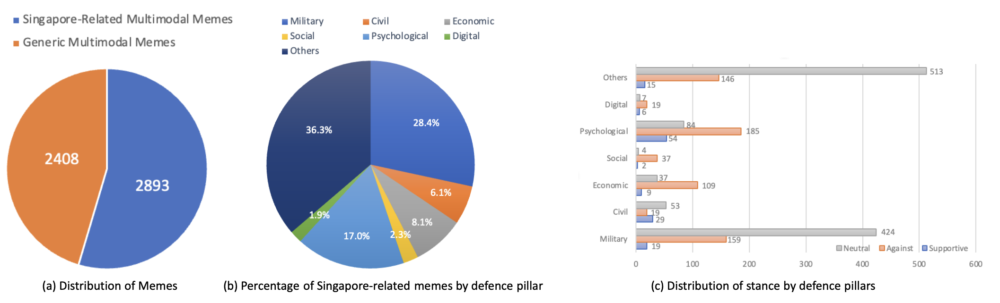

## Dependencies
simple-image-download <br/>
instaloader 

#### Data Collection

* Google - Data is collected form google search API using keywords for each of the 6 pillars <br/>
* Instagram - We use instaloader library(https://pypi.org/project/instaloader/) <br/>
    usage - instaloader profile [instagram page handle e.g. memedefsg] <br/>
    This creates a folder with the handle name and downloads visuals <br/>

|               | #Visuals      |
| ------------- | ------------- |
| Google search | 2,125         |
| Instagram     | 33,954        |
| Total         | 36,079        |


Instagram handles Used <br/>
<br/>
| #mindefmemes                       |
| @kmfst_                            |
| @memedefsg                         |
| @sgagsg                            |
| #sgmeme                            |
| #sgmemes                           |
| #singaporememes                    |
| @yeolo.sg                          |
| @mndsg_ (memes n dreams singapore) |
| @nus_memes                         |
| @smumemes                          |
| @pioneer_university                |
| @changicollege                     |
| @sgsocialworkmemes                 |
| @mas_complaints                    |
| @sit.tum.memes                     |

#### Dataset Annotation

| Dataset           | #Visuals | classes |
|:------------------|:----:|:---:|
|Non Memes          | 1,711     |     |
|SG Memes           | 2,893     |     |
|Non-SG Memes       | 2,408     |     |
|Pillars - Stance   | 2,513     | [Social,Economic,Psychological,Military,Civil,Digital,Others]-[Supportive,Neutral,Against] |
|Tags               | 2,513     |     |
|Text               | 7,012     |     |

Dataset is available [here](https://drive.google.com/file/d/1KgjldRB1UjzD4fJGTPoiJIgzLVTzWYoS/view?usp=sharing) <br/>
Annotation is available in report/annotation.json

Annotation stats (Krippendorf's alpha):
| Types           | Pillars | Stances |
|:----------------|:-------:|:-------:|
| 0.65            | 0.55    | 0.21    |


To cite:
```
To be Updated
```
